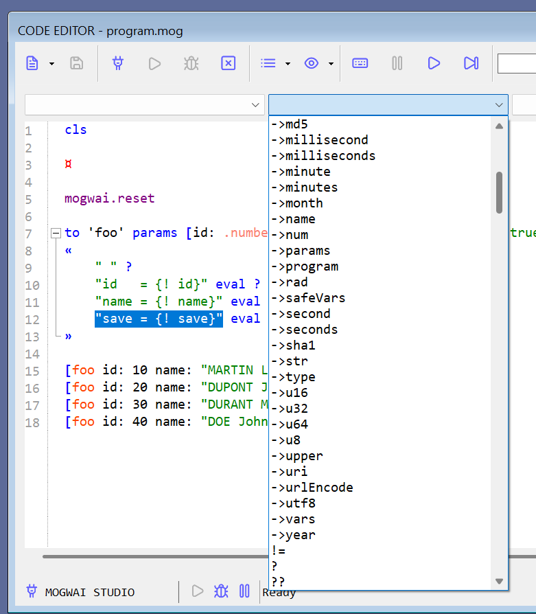

# Le runtime et le langage MOGWAI


## Introduction

**MOGWAI** est un langage de programmation très inspiré du **FORTH** et du **RPL**.

Il permet de "motoriser" vos applications avec un moteur d'exécution développé en .NET

Etant développé en .NET Standard, ce moteur peut être intégré aux applications .NET de type WinForms, WPF, MAUI, Console, Blazor, ASP, etc.

Pour mieux comprendre comment est né **MOGWAI**, voici [un petit article sur sa génèse](https://coding4phone.com/?p=329).

Vous pouvez aussi consulter [la documentation du langage](Documentation/MOGWAI_BASICS.pdf) pour vous faire une idée de sa syntaxe et de l'étendue de ses capacités.

## MOGWAI CLI

**MOGWAI CLI** est une application console qui permet d'utiliser le langage MOGWAI en mode interactif. Vous pouvez y utiliser toutes les commandes et fonctions du langage. Chaque ligne tapée est exécutée directement.


Il est possible de taper un "long" programme et de l'exécuter d'un bloc depuis **MOGWAI CLI** avec la fonction **_run_** du langage.

Par exemple, ce petit programme :

```
cls 

mogwai.reset

to 'foo' params [id: .number name: .string save: (.boolean true)] do 
« 
	" " ?
	"id   = {! id}" eval ?
	"name = {! name}" eval ?
	"save = {! save}" eval ?
»

[foo id: 10 name: "MARTIN Louis" save: false]
[foo id: 20 name: "DUPONT Jacques"]
[foo id: 30 name: "DURANT Marc"]
[foo id: 40 name: "DOE John" save: false]
```
Aura comme resultat d'exécution :


Vous pouvez consulter [la documentation de **MOGWAI CLI**](Documentation/MOGWAI_CLI.pdf) pour comprendre comment cette application fonctionne.

Elle est disponible pour les plateformes suivantes :

+ [Windows 32 bits (intel)](MOGWAI_CLI/Windows_32_bits_(intel).zip)
+ [Windows 64 bits (intel)](MOGWAI_CLI/Windows_64_bits_(intel).zip)
+ [Mac OSX 64 bits (intel)](MOGWAI_CLI/Mac_OSX_64_bits_(intel).zip)
+ [Mac OSX 64 bits (arm)](MOGWAI_CLI/Mac_OSX_64_bits_(arm).zip)
+ [Linux 64 bits (intel)](MOGWAI_CLI/Linux_64_bits_(intel).zip)
+ [Linux 64 bits (arm)](MOGWAI_CLI/Linux_64_bits_(arm).zip)

Vous pouvez télécharger la version de **MOGWAI CLI** adaptée à votre plateforme.

Pour l'utiliser, il suffit d'extraire l'archive où vous le souhaitez et lancer **MOGWAI CLI** depuis cet emplacement.

## MOGWAI STUDIO

**MOGWAI STUDIO** est un IDE de développement dédié au runtime **MOGWAI**. Il permet de se connecter à une application utilisant le runtime **MOGWAI** et d'effectuer toutes les opérations nécessaires pendant le processus de développement.


Il possède un éditeur de code avec coloration syntaxique, un débogueur avancé (permettant par exemple l'exécution pas à pas ou encore le changement des valeurs des variables en live), des fenêtres affichant l'état de la pile en temps réel, des variables, des événements, etc.


Les extraits de code simplifient la saisie des différents "acteurs" d'un programme (fonctions, événements, tâches, boucles, tests, etc).



Le runtime connecté à **MOGWAI STUDIO** lui fournit toutes les fonctions qu'il peut utiliser et toutes celles qui font partie des fonctions étendues (il est possible d'étendre le langage en lui ajoutant des fonctions en C#).

D'un runtime à un autre (version, usage), **MOGWAI STUDIO** s'adapte et ne propose que les fonctions réellement utilisables et reconnues.

Avec **MOGWAI STUDIO** le développement et la mise au point des programmes s'en trouvent grandement simplifiés.

**MOGWAI STUDIO** est disponible pour les plateformes suivantes :

+ [Windows 32 bits (intel)](MOGWAI_STUDIO/Windows_32_bits_(intel).zip)
+ [Windows 64 bits (intel)](MOGWAI_STUDIO/Windows_64_bits_(intel).zip)

Vous pouvez télécharger la version de **MOGWAI STUDIO** adaptée à votre plateforme.

Pour l'utiliser, il suffit d'extraire l'archive où vous le souhaitez et lancer **MOGWAI STUDIO** depuis cet emplacement.

## Les utilisations dans l'industrie

Le runtime **MOGWAI** a déjà été plusieurs fois utilisé dans des applications industrielles et de mise au point d'applications utilisant la communication série et Bluetooth Low Energy.

La dernière en date (octobre 2025) est un banc de tests d'appareils électroniques (développé en C# ?.NET 8 pour Windows) qui utilise le runtime **MOGWAI** pour l'écriture de tous les tests pour les différents produits concernés.


